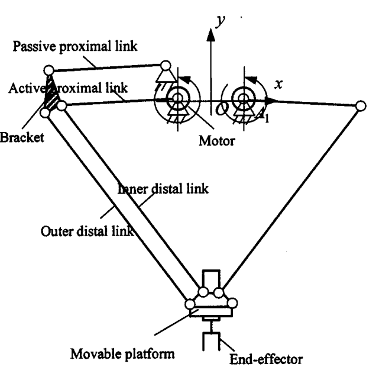
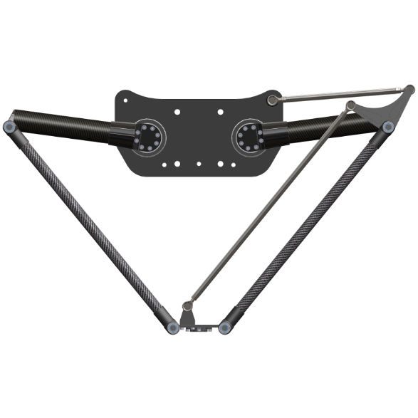
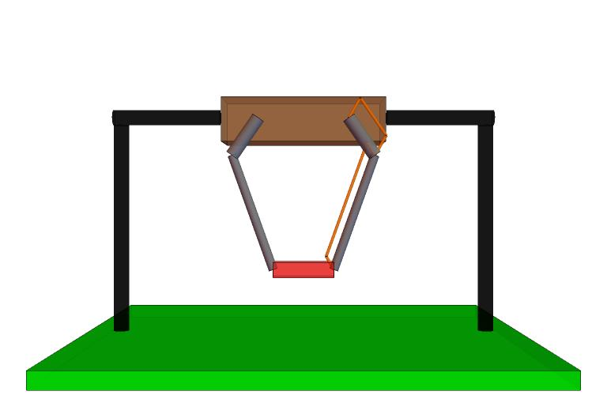
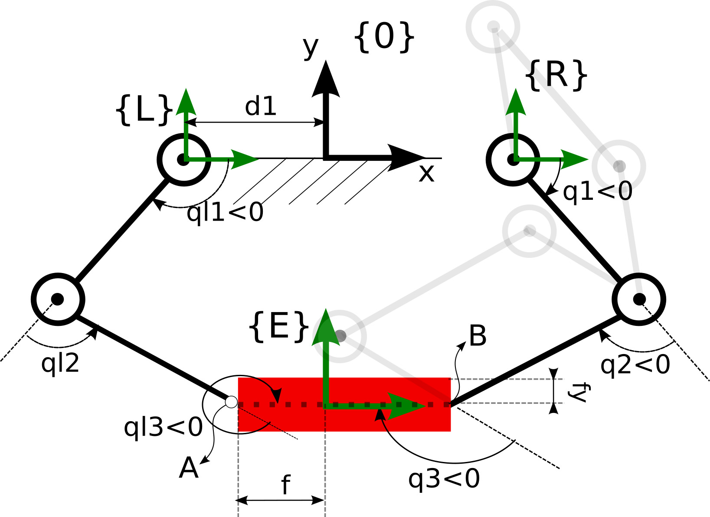
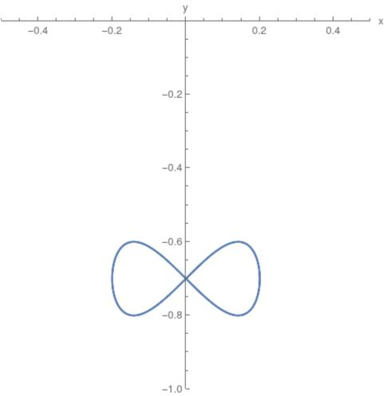

# Diamond-Robot

The Diamond Robot is a specialized parallel robot designed for applications where precise control of the end-effector orientation is crucial.

    
    

### Content

In the `DiamondRobot.m` file you can find the robot **modelization**, **planning** and **control** using several techniques:
- Computed Torque
- Adaptive Computed Torque
- Backstepping
- Adaptive Backstepping
- Trace Control

The file `ScrewCalculusPro.m` contains a library used to obtain the robot kinematic and dynamic equations.

### Modelization

The robotics dynamic equations have been obtained through the **Denavit-Hartenberg** robot parameterization.

    
    

### Planning

The aim is to make the end-effector following this trajectory:

    

### Control

This is a simulation of the control obtained using **Adaptive Backstepping**:

    

